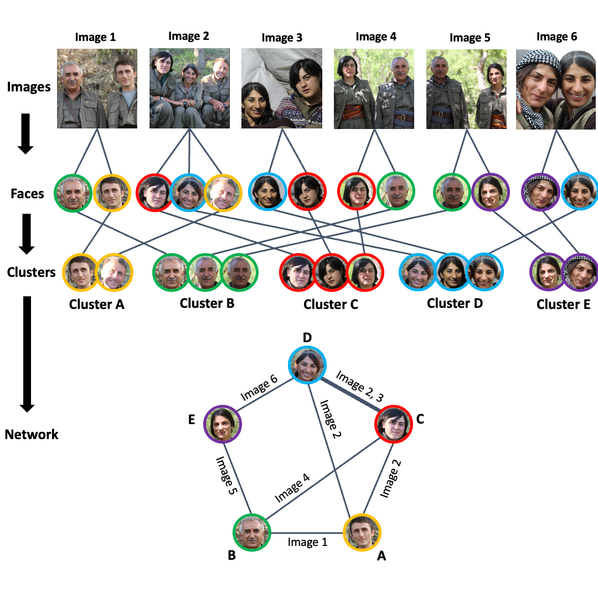
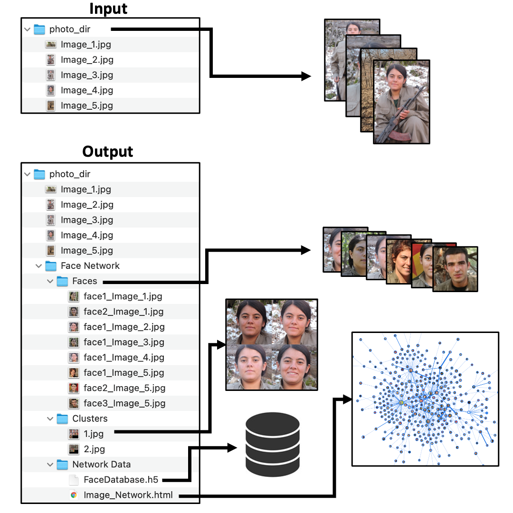

# face-network
Create a social network graph based on coappearance in images. Given a large volume of images of people this tool:

1. Extracts faces 
2. Clusters faces based on similarity 
3. Creates a social network graph based on co-appearance in images 

The three steps above correspond to the black arrows on the left of the diagram below: 



## 1. Extracting faces 

```python
face_network.extract_faces(source_dir, age_gender=False)
```

This function extracts all faces from a directory of images using Dlib’s face detector, and must be run prior to further analysis.

## 2. Clustering Faces 

```python
face_network.network(source_dir, algorithm='DBSCAN', iterations=1, initial_eps=0.45, max_distance=45)
```

Once faces are extracted, similar faces are clustered together. This function uses a density-based clustering algorithm (DBSCAN) to identify clusters of similar faces in the list of facial encodings. Starting with loose clustering parameters, the function iteratively decreases the neighborhood distance parameter. In each iteration, facial similarity within clusters is evaluated. Dense clusters are extracted, and sparse clusters are assigned to be re-evaluated in the next iteration. When an iteration returns no new clusters, the function returns a dataframe containing facial encodings grouped into clusters based on similarity.

## 3. Generating a Network

```python
face_network.network(photo_dir, size=10)
```

Having identified individuals across multiple pictures, this function generates a force directed graph based on co-appearance in images. Each individual is a node, and each co-appearance is an edge. 


# Example Project

Given a folder called “photo_dir” with five images, the following process extracts faces, clusters similar faces, and creates a co-appearance network:
```python
import face_network
photo_dir=”./Downloads/photo_dir”

face_network.extract(photo_dir, age_gender=True)

face_network.cluster(photo_dir, algorithm='DBSCAN', iterations=10, initial_eps=0.44, max_distance=40)

face_network.network(photo_dir, size=20)
```

The diagram below shows the file structure of the resulting outputs:


