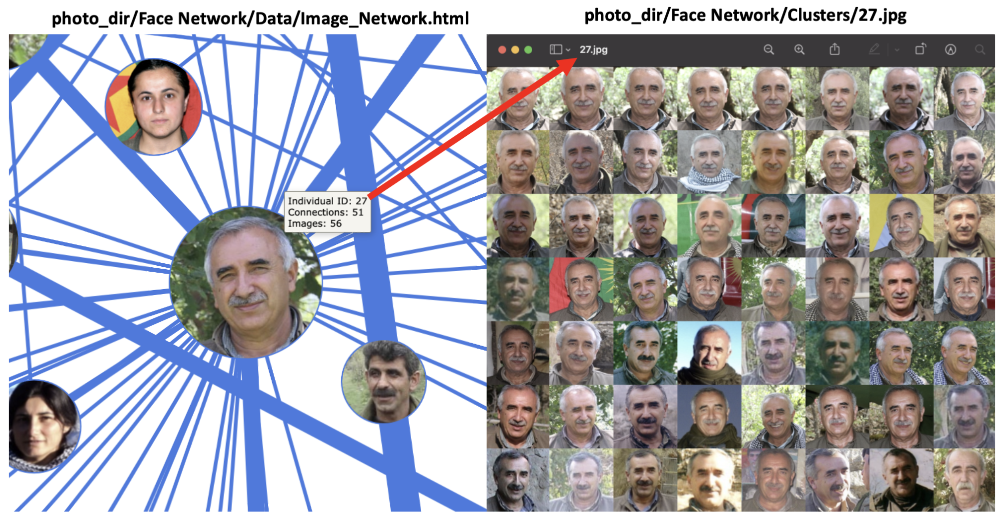

# face-network
Create a social network graph based on coappearance in images. Given a large volume of images of people this tool:

1. Extracts faces 
2. Clusters faces based on similarity 
3. Creates a social network graph based on co-appearance in images 

The three steps above correspond to the black arrows on the left of the diagram below: 

