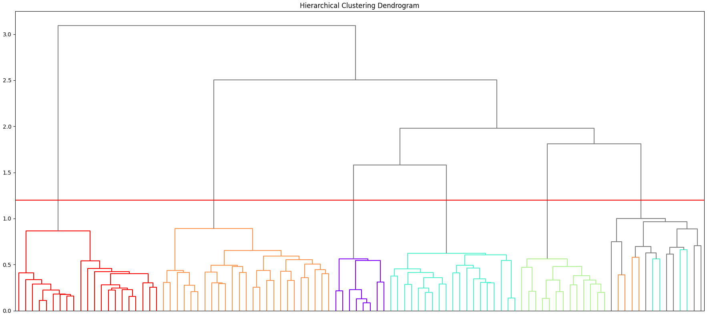

============================
Clustering Similar Faces
============================

Once faces are extracted, similar faces are clustered together. This function uses a density-based clustering algorithm (DBSCAN) to identify clusters of similar faces in the list of facial encodings. Starting with loose clustering parameters, the function iteratively decreases the neighborhood distance parameter. In each iteration, facial similarity within clusters is evaluated. Dense clusters are extracted, and sparse clusters are assigned to be re-evaluated in the next iteration. When an iteration returns no new clusters, the function returns a dataframe containing facial encodings grouped into clusters based on similarity.

.. code-block:: python
	
	face_network.network(source_dir, algorithm='DBSCAN', iterations=1, initial_eps=0.45, max_distance=45)

Parameters
==========

:source_dir: (*str*) The path to the image folder
:algorithm: (*{‘DBSCAN’,’OPTICS’,’AHC’}, default=”DBSCAN”*) The algorithm used for clustering. Possible options are “`DBSCAN`_”, “`OPTICS`_”, and “`AHC`_” (agglomerative hierarchical clustering).
:iterations: (*int, default=10*) The number of iterations that the function will perform. Each iteration restricts the clustering parameters.
:max_distance: (*float, default=50*) Sets the maximum euclidean distance between each face in a cluster and the core sample. This weeds out outliers and sparse clusters.
:initial_eps: (*float, default=0.45*) Determines Sets the Epsilon parameter for the DBSCAN algorithm. 
:mosaic: (*bool, default=True*) Creates a mosaic of face tiles for each image. 

Outputs
=======

Rows in the FaceDatabase.h5 file now contain a unique numeric identifier, grouping similar faces into clusters. If the “mosaic” option is enabled, an image composed of all of the face tiles in a given cluster is created:

.. figure::  images/image6.png

Performance
===========

The graph below shows the effect of tuning the “max_distance” parameter on clustering accuracy in the LFW dataset, using the DBSCAN algorithm. 

.. figure::  images/image2.png

The optimal range seems to be between 50 and 60: if the cutoff is too low, false negatives increase as faces are not sorted into clusters. If the cutoff is too high, the number of false positives increases. Optimal parameters will vary based on your dataset. Further information on the clustering evaluation metrics used above can be found `here`_. 

A visual representation of the clustering process is shown in the dendrogram below, generated using Agglomerative Hierarchical Clustering (AHC). Each "leaf node" (the points where the dendrogram intersects the X axis) represents a face. The Y axis indicates the euclidean distance (similarity) between facial encodings. If the link between two leaf nodes is very low, the facial encodings are more similar. An interesting property of using AHC to cluster facial images is that the first branch of the dendrogram almost always separates men and women. 

The example above uses 100 labeled faces, with colors denoting images of the same individual. We can see groups of faces that are all quite similar to eachother, but quite dissimilar from faces in the other groups. We could probably tell without relying on the colors that there are 5-6 distinct individuals in these 100 images. Indeed, the colors suggest there are 5 main individuals and one "bin" cluster on the far right composed mainly of unlabeled faces (the grey leaf nodes). There are some errant faces from two of the five individuals in this cluster, likely due to poor image quality, pose, or lighting. 94 out of the 100 faces above are labeled. Of these, 86 (91%) were correctly sorted into clusters representing distinct individuals using the red cutoff line. 

.. _`here`: https://nlp.stanford.edu/IR-book/html/htmledition/evaluation-of-clustering-1.html

.. _`DBSCAN`: https://scikit-learn.org/stable/modules/generated/sklearn.cluster.DBSCAN.html

.. _`AHC`: https://scikit-learn.org/stable/modules/generated/sklearn.cluster.AgglomerativeClustering.html

.. _`OPTICS`: https://scikit-learn.org/stable/modules/generated/sklearn.cluster.OPTICS.html

